# OpenVLA Finetune and Evaluation on Libero Benchmark

本仓库用于复现并记录 [OpenVLA](https://github.com/openvla/openvla) 在 LIBERO 基准上的微调与评测流程，包含环境配置、训练脚本、评测结果与案例分析。

## 实际效果展示 

以 `LIBERO-Spatial` 为例：

|                ✅ 成功测试1                 |                ✅ 成功测试2                 |                ✅ 成功测试3                 |
| :----------------------------------------: | :----------------------------------------: | :----------------------------------------: |
|  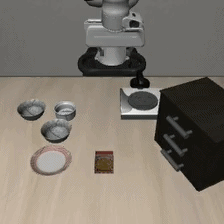  |  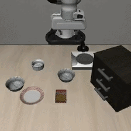   |  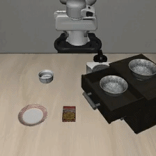   |
| 拿起位于盘子和小碗之间的黑色碗并放在盘子上 |      拿起桌子中央的黑色碗并放在盘子上      | 拿起木质柜子顶层抽屉里的黑色碗并放在盘子上 |
|              ✅ **成功测试4**               |              ✅ **成功测试5**               |              ✅ **成功测试6**               |
|  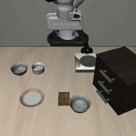  |  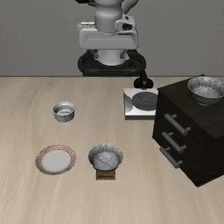   |  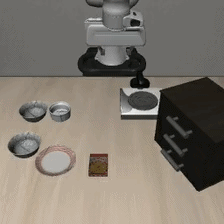   |
|    拿起位于小碗旁边的黑色碗并放在盘子上    | 拿起放在饼干盒上的黑色碗，并把它放到盘子中 |    拿起位于盘子旁边的黑色碗并放在盘子上    |

以上的六个测试用例都是成功的测试用例，接下来再展示几个失败的测试用例：

|                         ❌ 失败测试1                          |                         ❌ 失败测试2                          |                         ❌ 失败测试3                          |
| :----------------------------------------------------------: | :----------------------------------------------------------: | :----------------------------------------------------------: |
|           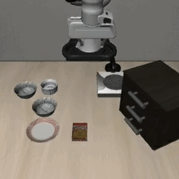            |           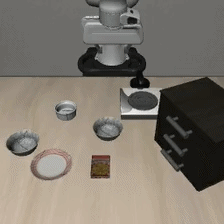           |           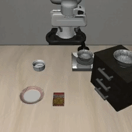           |
|          拿起位于盘子和小碗之间的黑色碗并放在盘子上          |               拿起桌子中央的黑色碗并放在盘子上               |              拿起位于炉子上的黑色碗并放在盘子上              |
| **失败原因**：对炉子上的黑色碗的位置判断不够准确，当机械臂还没有移动到准确的位置时，就执行了抓取动作 | **失败原因**：模型处于过拟合或者策略坍缩，训练数据里包含了很多“静止”的片段或模型可能已经“背过”了训练集里的特定轨迹 | **失败原因**：抓取后视觉特征突变使模型陷入未知分布，策略不确定性引发动作指令的微小震荡与冲突，最终表现为停滞与轻微滑动。 |

### 最终结论

-   这次 `libero_spatial` 基准测试包含了 10 个任务，每个任务执行 **5 次试验**，共计 50 个 episode。之所以采用这样的测试规模，主要是出于对**计算时间和资源消耗**的综合考虑。
-   最终成功 **13/50**，总成功率 **26.0%**

### 各任务详细表现

1.  **pick up the black bowl between the plate and the ramekin and place it on the plate** - 60%成功率 (3/5)
2.  **pick up the black bowl next to the ramekin and place it on the plate** - 80%成功率 (4/5) ⭐最佳表现
3.  **pick up the black bowl from table center and place it on the plate** - 0%成功率 (0/5) 
4.  **pick up the black bowl on the cookie box and place it on the plate** - 20%成功率 (1/5)
5.  **pick up the black bowl in the top drawer of the wooden cabinet and place it on the plate** - 20%成功率 (1/5)
6.  **pick up the black bowl on the ramekin and place it on the plate** - 20%成功率 (1/5)
7.  **pick up the black bowl next to the cookie box and place it on the plate** - 0%成功率 (0/5)
8.  **pick up the black bowl on the stove and place it on the plate** - 0%成功率 (0/5)
9.  **pick up the black bowl next to the plate and place it on the plate** - 60%成功率 (3/5)
10.  **pick up the black bowl on the wooden cabinet and place it on the plate** - 0%成功率 (0/5)

### 关键观察

#### 成功模式

-   模型在**相对简单的位置关系**上表现较好（如"next to ramekin"任务达到80%）
-   对于**明确的空间关系描述**的任务完成度较高

#### 失败模式

-   **复杂空间关系**任务表现很差（如抽屉内、橱柜上、炉子上等位置）
-   **需要精细操作**的任务几乎全部失败
-   **遮挡或复杂场景**下的物体识别和操作能力有限

#### 时间消耗

-   平均每个episode耗时约38秒
-   总运行时间约28分钟完成所有50个测试

## 训练情况

在 [无问芯穷](https://cloud.infini-ai.com/platform/ai) 平台租赁 GPU 进行训练，训练时间约为 120 mins，开发机配置如下：

|       显卡配置       | 训练网配置 | 显卡数量 | vCPU核数 | 内存GiB | 共享内存GiB |
| :------------------: | :--------: | :------: | :------: | :-----: | :---------: |
| NVIDIA A800-80G PCIe |     IB     |    1     |    10    |   115   |     57      |

其中 `batch_size = 16`，`total_steps=50000`，`lora_rank = 32`。

训练损失、L1 loss、动作准确率：

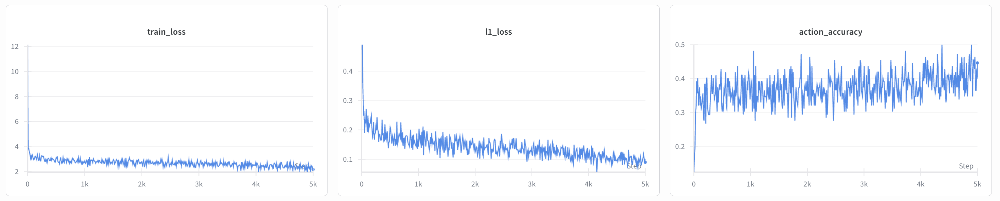

GPU 占用情况：

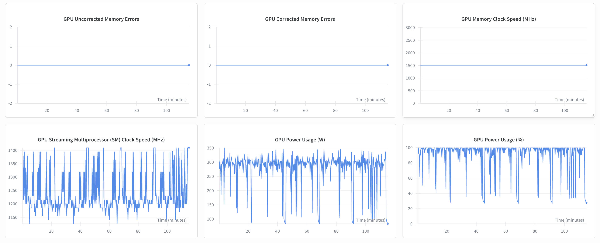

## openvla 环境配置

查看文件 [OpenVLA 环境配置](docs/01%20Env_Setup.md)。

如果涉及 SSH 代理问题，可以参考文件 [SSH_Proxy.md](docs/03%20SSH_Proxy.md)。

## openvla 微调

查看文件 [OpenVLA 微调](docs/02%20Fine_Tune.md)。